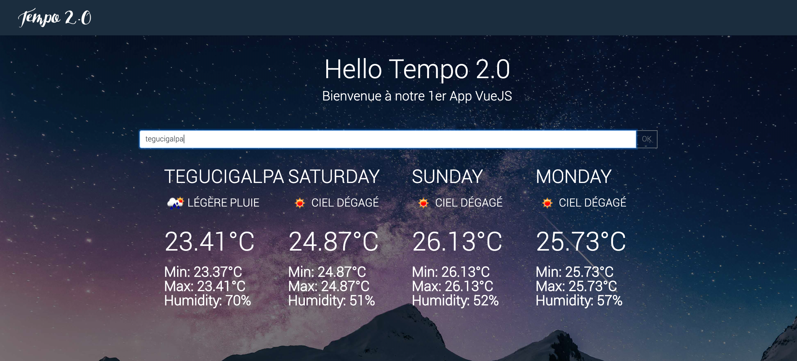
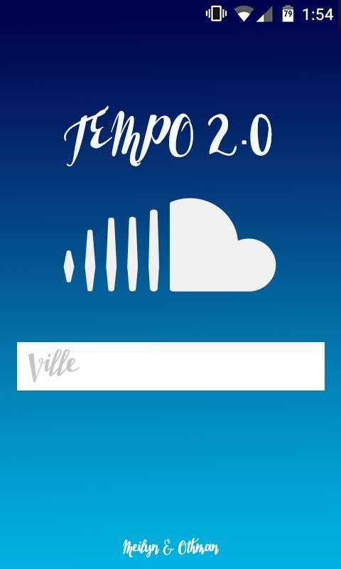
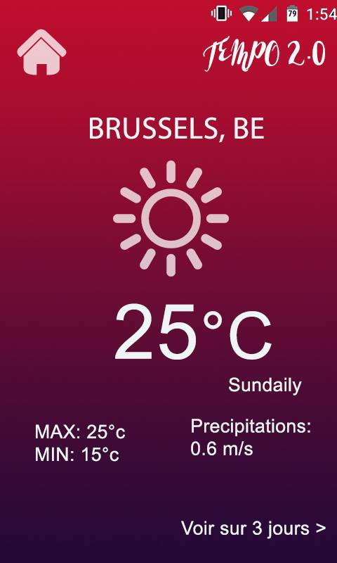
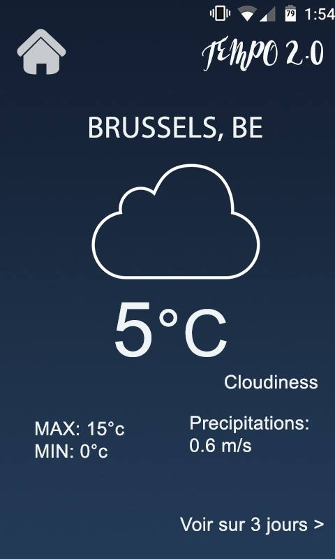

# Application météo

***Collaborator*** 

- [Meilyn Andrade](https://github.com/Meilyn)
- [Othman MOULILA](https://github.com/luffy1140)
- Temps nécessaire : 3 jours ouvrables
- Où : BeCode 
- Quand: 2-4 Avril 2019
- lien: 

##Projet

Application Météo créé avec VueJS composé d'un input de recherche pour la ville.

## Langages utilisés

- HTML5&CSS3 (GRID)
- VueJS

## Build Setup

```
# install dependencies
npm install

# serve with hot reload at localhost:8080
npm run dev

# build for production with minification
npm run build
```
### Resultat final


### MAQUETTE





